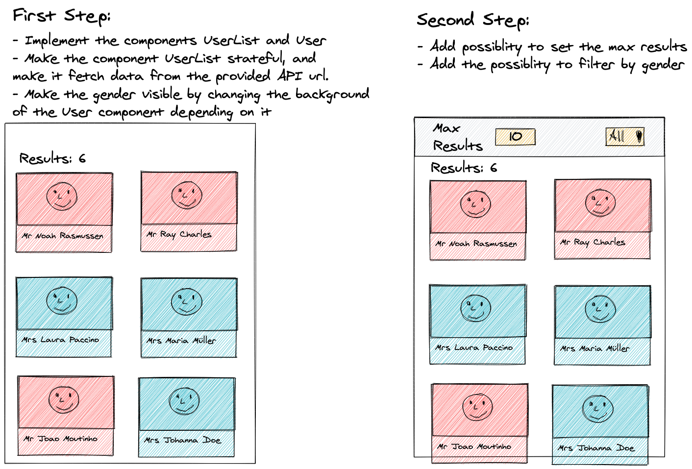

# Exercise 4: Fetching from an API

We want to render the users coming from the endpoint `https://randomuser.me/api/?inc=email,gender,name,picture&results=10`.

The data from the API looks like:

```json
{
  "results": [
    {
      "gender": "female",
      "name": {
        "title": "Ms",
        "first": "Eva",
        "last": "Myers"
      },
      "email": "eva.myers@example.com",
      "picture": {
        "large": "https://randomuser.me/api/portraits/women/56.jpg",
        "medium": "https://randomuser.me/api/portraits/med/women/56.jpg",
        "thumbnail": "https://randomuser.me/api/portraits/thumb/women/56.jpg"
      }
    },
    {
      "gender": "male",
      "name": {
        "title": "Mr",
        "first": "Philip",
        "last": "Gill"
      },
      "email": "philip.gill@example.com",
      "picture": {
        "large": "https://randomuser.me/api/portraits/men/59.jpg",
        "medium": "https://randomuser.me/api/portraits/med/men/59.jpg",
        "thumbnail": "https://randomuser.me/api/portraits/thumb/men/59.jpg"
      }
    }
  ],
  "info": {
    "seed": "8fd6cea970273366",
    "results": 2,
    "page": 1,
    "version": "1.3"
  }
}
```

## Step 1

For that, you already have prepared 2 files under the `components/` folder.

- `User` component. Requirements:

  - It must be a dumb (stateless) component
  - It should render the full name of the user, including the title
  - It should change its background depending on the gender
  - It should render the picture of the user

- `UserList` component. Requirements:
  - It must be a stateful component
  - On first render, it should get the data coming from the API and store it
    in its state. Make it use an effect, where you use the `fetch` function to get the data from the API.
  - It should render the list of users using the `User` componen you defined before.

## Step 2

Change the `UserList` component so it allows you to:

- Change the amount of results you get (now limited to 10) to be any number you want.
- Make it possible to filter the results by gender (ALL, Female, Male)
  - You can do it in 2 ways:
    - Passing a query parameter to the url so you just receive that data from the API
    - Filtering the data you already fetched inside the app.
    - Which one do you think is better?

You can check the documentation of the API here:
https://randomuser.me/documentation#results

## Mockup for orientation



### Tips

- Start with a static app. Create the components first, all of them dumb. Use them and look how they would look like. After you are done with that, start making it dynamic.
- All the users have a unique email. That's a great candidate for the `key` when you generate the `Users` dynamically with `map`.
- Don't worry much about styling. The goal of this exercise is not to make the most beautiful app, but to learn how to use the `useEffect` hook for a real world scenario: getting data from an external API.
